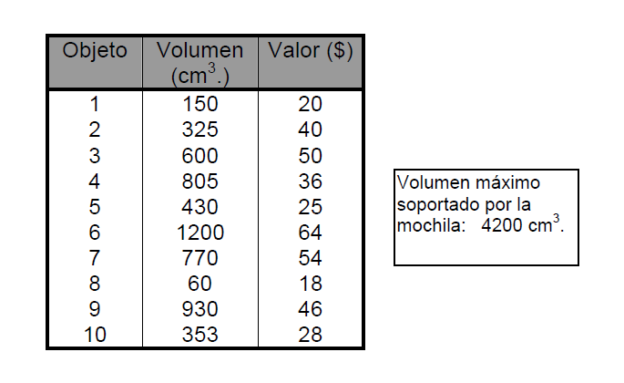

<h1>Problema de la mochila</h1>

Consiste en elegir, de entre un conjunto de <b>n elementos</b>, (cada uno con un valor $i, y un volumen Vi), aquellos que puedan ser cargados en una mochila de volumen V de manera que el <b>valor obtenido</b> sea <b>máximo</b>.

Utilizando una computadora, resolver el siguiente problema:

<i>Cuáles son los elementos de la lista siguiente que cargaremos en una mochila de 4200 cm3 de manera que su valor en $ sea máximo.</i>

Para su solución, utilizar un <b>procedimiento exhaustivo</b> que consiste en evaluar para cada subconjunto de elementos el valor correspondiente y, posteriormente, <b>clasificando los subconjuntos por su valor de mayor a menor</b>, encontrar cuál es el subconjunto solución.

<b>Ejercicios:</b>
<ol>
  <li>
      Resolver el <b>problema de la Mochila utilizando una búsqueda exhaustiva</b>.
  </li>
  <li>
      Resolver el ejercicio anterior usando el <b>algoritmo greedy</b> y comentar su similitud o no con el exhaustivo.
  </li>
  <li>
      Plantear el problema de la mochila teniendo en cuenta los <b>pesos</b> en lugar del volumen. Luego, <b>dados 3 elementos</b>, cuyos pesos son:
      <ul>
        <li>1800 grs.</li>
        <li>600 grs.</li>
        <li>1200 grs.</li>
      </ul>
      y cuyos valores son:
      <ul>
        <li>$72</li>
        <li>$36</li>
        <li>$60</li>
      </ul>
      respectivamente, y con una mochila que puede soportar hasta <b>3000 grs.</b> se pide:
      <ol type="A">
          <li>
            Hallar una solución <b>utilizando un algoritmo goloso y exhaustivo</b>.
          </li>
          <li>
            <b>Analizar dicha solución respecto a su grado de optimización</b> y elaborar las <b>conclusiones</b> que considere adecuadas.
          </li>
      </ol>
  </li>
</ol>
